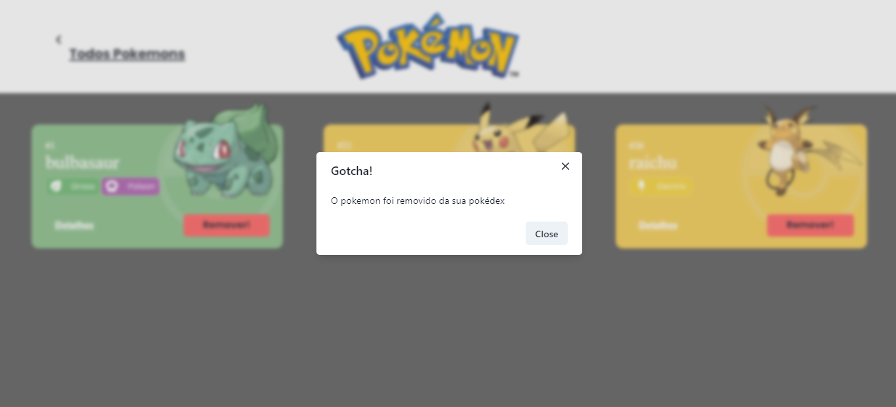

- Projeto React e APIs (Pokédex) -

O Projeto React e APIs é um site de pokémons que possui três páginas: Home, Pokedex e Detalhes. O projeto está subdivido em temas de acordo com os conteúdos estudados durante o Módulo 2 - Frontend.

Este projeto tem como fonte de dados para a sua criação a Poke Api, uma Api pública, muito usada para aplicações focadas em aprendizado de programação e também usada em cases de processos seletivos.

Os conteúdos principais são:

Integração de APIs
React Router
Design Systems
Estado Global
Styled-components
React Context
Axios
Local Storage

Requisitos

Gerais:
O site contém 3 páginas: Home, Pokedex e Detalhes;
Projeto deve segue um design proposto;
O fluxo de trocas de páginas é semelhante ao fluxograma;

Página Home:
Mostra uma lista de Pokemons, contendo ao menos 20 Pokemons;
Cada Pokemon é representado por um Card;
Em cada card de Pokemon tem um botão para adicioná-lo à Pokedex e um outro botão para acessar os detalhes do Pokemon;
Header dessa página tem um botão para acessar a página da Pokedex;

Página Pokédex:
Renderiza a lista de pokémons adicionados na pokedex;
Em cada card de Pokemon contém um botão para removê-lo da Pokedex e um outro botão para acessar os detalhes do Pokemon;
Header contém um botão para voltar para a Home;
Não é possível adicionar o mesmo Pokemon duas vezes na Pokedex;

Página de Detalhes:
Mostra os detalhes do Pokemon selecionado, com informações descritas;
Header deve ter um botão para adicionar ou remover da Pokedex e outro para voltar a página home.

Link para o projeto: https://pokedex-henriquediasper.surge.sh/

